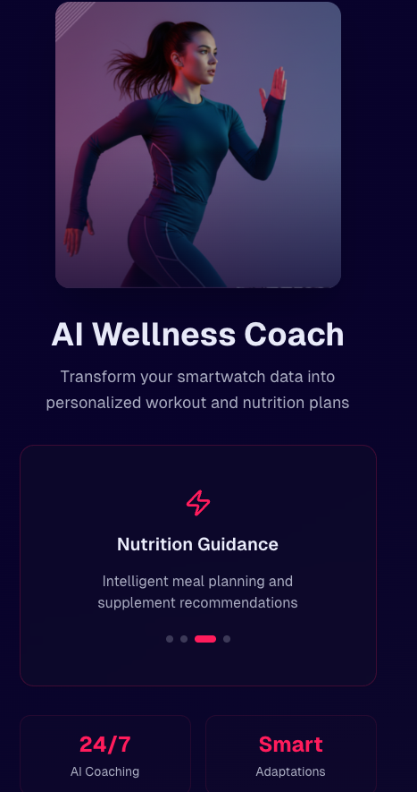
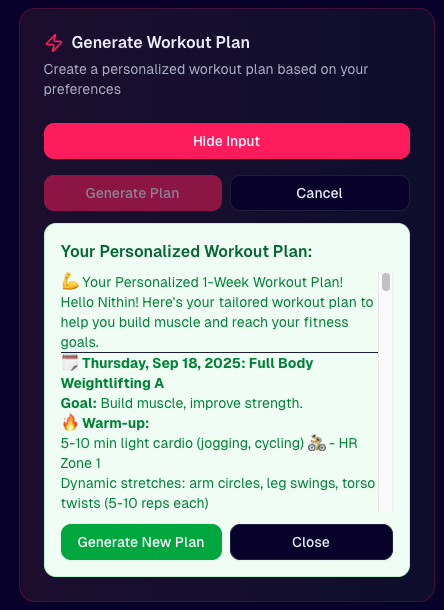
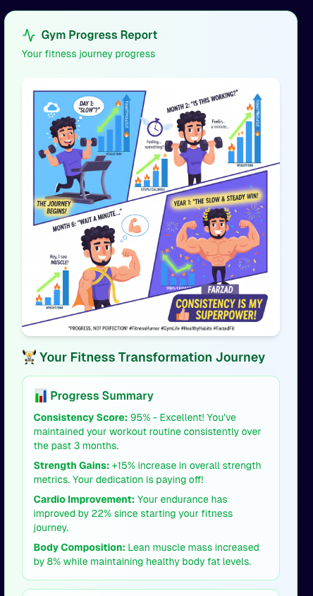
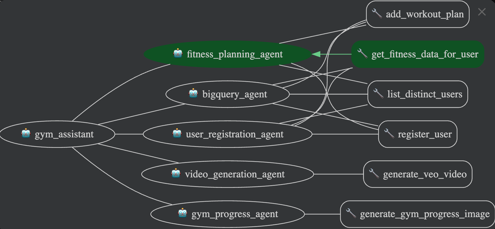
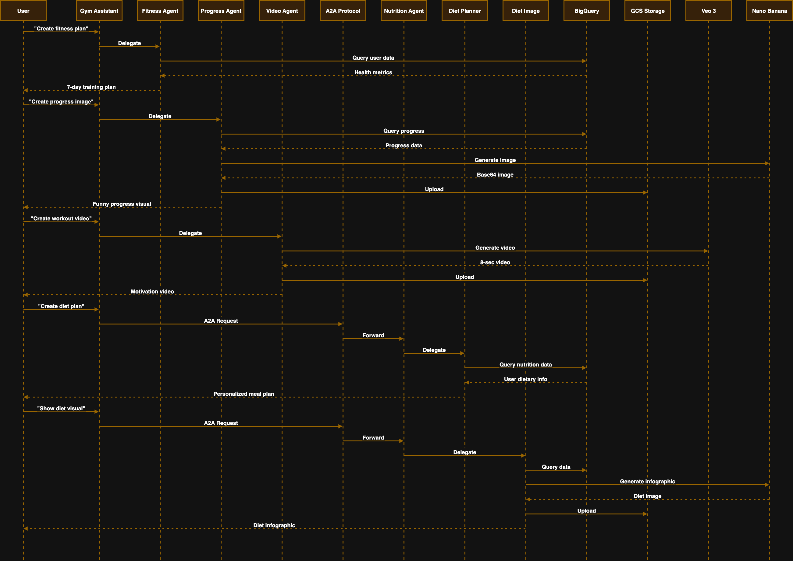

# AI Wellness Coach

A comprehensive AI-powered wellness coaching system built with Google's Agent Development Kit (ADK) and featuring a modern Next.js frontend. This application provides personalized fitness planning, nutrition guidance, and progress tracking through intelligent agent interactions.



## Features

### 🏋️ Workout Planning
Generate personalized workout plans based on user preferences, fitness level, and goals.



### 📊 Progress Tracking
Monitor your fitness journey with detailed progress reports and analytics.



### 🤖 Multi-Agent Architecture
The system uses multiple specialized agents working together to provide comprehensive wellness guidance.






## Project codes

staging : qwiklabs-gcp-00-a489584c5286
prod : qwiklabs-gcp-01-4966a7ce7870

## Working request

curl \                      
-H "Authorization: Bearer $(gcloud auth print-access-token)" \
-H "Content-Type: application/json" \
https://europe-west3-aiplatform.googleapis.com/v1/projects/579492671276/locations/europe-west3/reasoningEngines/7789468136746516480:streamQuery\?alt\=sse -d '{
  "class_method": "stream_query",
  "input": {
    "message": "list the users?",
    "user_id": "test_user"
  }
}'

https://cloud.google.com/vertex-ai/generative-ai/docs/agent-engine/use/overview#requests_3


## MCP Toolset

https://googleapis.github.io/genai-toolbox/how-to/deploy_toolbox/


curl 'http://localhost:8000/run' \
  -H 'Content-Type: application/json' \
  -H 'Connection: keep-alive' \
  --data-raw '{"app_name":"gym_assistant","user_id":"user_nt_nithinkumara_gmail_com_1758180625004","session_id":"session_1758180625004","new_message":{"role":"user","parts":[{"text":"Please register this user with the following information:\n\nPersonal Information:\n- Email: nt.nithinkumara@gmail.com\n- Age: 32 years\n- Gender: male\n- Height: 171 cm\n- Current Weight: 23 kg\n- Goal Weight: 76 kg\n\nFitness Profile:\n- Experience Level: beginner\n- Workout Days per Week: 3\n- Preferred Workout Types: Yoga, Swimming\n- Fitness Goals: Reduce Stress\n\nHealth Information:\n- Health Notes: asdsa\n\nPlease register this user in the system."}]},"streaming":false}'

## Project Structure

This project is organized as follows:

```
health-assistant/
├── app/                 # Core application code
│   ├── agent.py         # Main agent logic
│   ├── agent_engine_app.py # Agent Engine application logic
│   ├── sub_agents/      # Specialized agent modules
│   ├── tools/           # Agent tools and configurations
│   └── utils/           # Utility functions and helpers
├── ui/                  # Next.js frontend application
│   ├── app/             # Next.js app directory
│   ├── components/      # React components
│   ├── lib/             # Utility functions
│   └── public/          # Static assets
├── docs/                # Documentation and assets
│   └── assets/          # Images and diagrams
├── deployment/          # Infrastructure and deployment scripts
├── notebooks/           # Jupyter notebooks for prototyping and evaluation
├── tests/               # Unit, integration, and load tests
├── Makefile             # Makefile for common commands
├── GEMINI.md            # AI-assisted development guide
└── pyproject.toml       # Project dependencies and configuration
```

## Requirements

Before you begin, ensure you have:
- **uv**: Python package manager (used for all dependency management in this project) - [Install](https://docs.astral.sh/uv/getting-started/installation/) ([add packages](https://docs.astral.sh/uv/concepts/dependencies/) with `uv add <package>`)
- **Node.js & npm**: For frontend development - [Install](https://nodejs.org/)
- **Google Cloud SDK**: For GCP services - [Install](https://cloud.google.com/sdk/docs/install)
- **Terraform**: For infrastructure deployment - [Install](https://developer.hashicorp.com/terraform/downloads)
- **make**: Build automation tool - [Install](https://www.gnu.org/software/make/) (pre-installed on most Unix-based systems)


## Environment Setup

**Important**: Before running the application, you need to set up environment variables in both the root directory and the `ui` folder.

### Root Directory Environment Variables
Create a `.env` file in the root directory based on `.env.dev`:

```bash
cp .env.dev .env
```

Required variables:
- `GOOGLE_GENAI_USE_VERTEXAI`: Set to "False" for local development
- `GOOGLE_API_KEY`: Your Google API key for Nano banana and veo3
- `GOOGLE_CLOUD_PROJECT`: Your Google Cloud project ID
- `GOOGLE_CLOUD_LOCATION`: Cloud deployment location (e.g., "europe-west3")

### UI Directory Environment Variables
Create a `.env` file in the `ui` folder based on `.env.dev`:

```bash
cd ui
cp .env.dev .env
```

Required variables:
- `NEXT_PUBLIC_API_BASE_URL`: The URL of your backend API
- `NEXT_PUBLIC_SKIP_ONBOARDING`: Set to "false" for development
- `NODE_ENV`: Set to "development" for local development
- `ADK_ROOT_AGENT`: Set to "app" (the folder containing agent.py)

## Quick Start (Local Testing)

### Backend Setup
Install Python dependencies and start the backend API server:

```bash
make install
make playground-api
```

### Frontend Setup
In a separate terminal, navigate to the UI folder and start the frontend:

```bash
cd ui
npm install
npm run dev
```

The application will be available at:
- Frontend: http://localhost:3000
- Backend API: http://localhost:8000

## Commands

### Backend Commands
| Command              | Description                                                                                 |
| -------------------- | ------------------------------------------------------------------------------------------- |
| `make install`       | Install all required dependencies using uv                                                  |
| `make playground`    | Launch Streamlit interface for testing agent locally and remotely |
| `make playground-api`| Start the backend API server for frontend integration |
| `make backend`       | Deploy agent to Agent Engine |
| `make test`          | Run unit and integration tests                                                              |
| `make lint`          | Run code quality checks (codespell, ruff, mypy)                                             |
| `make setup-dev-env` | Set up development environment resources using Terraform                         |
| `uv run jupyter lab` | Launch Jupyter notebook                                                                     |

### Frontend Commands
| Command              | Description                                                                                 |
| -------------------- | ------------------------------------------------------------------------------------------- |
| `npm install`        | Install frontend dependencies (run in `ui/` folder) |
| `npm run dev`        | Start development server (run in `ui/` folder) |
| `npm run build`      | Build production version (run in `ui/` folder) |
| `npm run start`      | Start production server (run in `ui/` folder) |

For full command options and usage, refer to the [Makefile](Makefile).


## Usage

This template follows a "bring your own agent" approach - you focus on your business logic, and the template handles everything else (UI, infrastructure, deployment, monitoring).

1. **Prototype:** Build your Generative AI Agent using the intro notebooks in `notebooks/` for guidance. Use Vertex AI Evaluation to assess performance.
2. **Integrate:** Import your agent into the app by editing `app/agent.py`.
3. **Test:** Explore your agent functionality using the Streamlit playground with `make playground`. The playground offers features like chat history, user feedback, and various input types, and automatically reloads your agent on code changes.
4. **Deploy:** Set up and initiate the CI/CD pipelines, customizing tests as necessary. Refer to the [deployment section](#deployment) for comprehensive instructions. For streamlined infrastructure deployment, simply run `uvx agent-starter-pack setup-cicd`. Check out the [`agent-starter-pack setup-cicd` CLI command](https://googlecloudplatform.github.io/agent-starter-pack/cli/setup_cicd.html). Currently supports GitHub with both Google Cloud Build and GitHub Actions as CI/CD runners.
5. **Monitor:** Track performance and gather insights using Cloud Logging, Tracing, and the Looker Studio dashboard to iterate on your application.

The project includes a `GEMINI.md` file that provides context for AI tools like Gemini CLI when asking questions about your template.


## Deployment

> **Note:** For a streamlined one-command deployment of the entire CI/CD pipeline and infrastructure using Terraform, you can use the [`agent-starter-pack setup-cicd` CLI command](https://googlecloudplatform.github.io/agent-starter-pack/cli/setup_cicd.html). Currently supports GitHub with both Google Cloud Build and GitHub Actions as CI/CD runners.

### Dev Environment

You can test deployment towards a Dev Environment using the following command:

```bash
gcloud config set project <your-dev-project-id>
make backend
```


The repository includes a Terraform configuration for the setup of the Dev Google Cloud project.
See [deployment/README.md](deployment/README.md) for instructions.

### Production Deployment

The repository includes a Terraform configuration for the setup of a production Google Cloud project. Refer to [deployment/README.md](deployment/README.md) for detailed instructions on how to deploy the infrastructure and application.


## Monitoring and Observability
> You can use [this Looker Studio dashboard](https://lookerstudio.google.com/reporting/46b35167-b38b-4e44-bd37-701ef4307418/page/tEnnC
) template for visualizing events being logged in BigQuery. See the "Setup Instructions" tab to getting started.

The application uses OpenTelemetry for comprehensive observability with all events being sent to Google Cloud Trace and Logging for monitoring and to BigQuery for long term storage.
